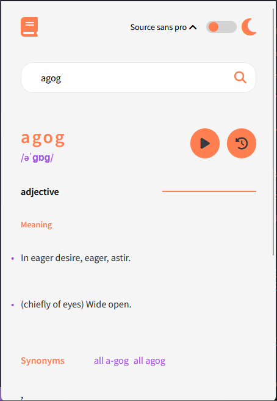
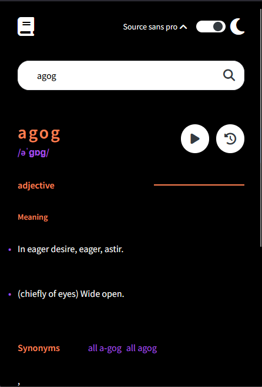
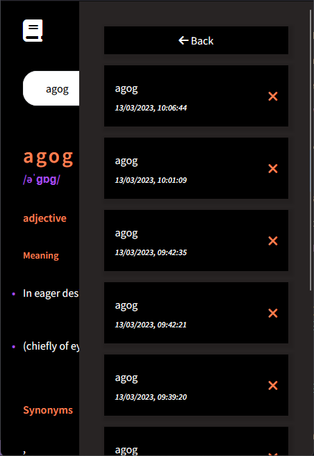
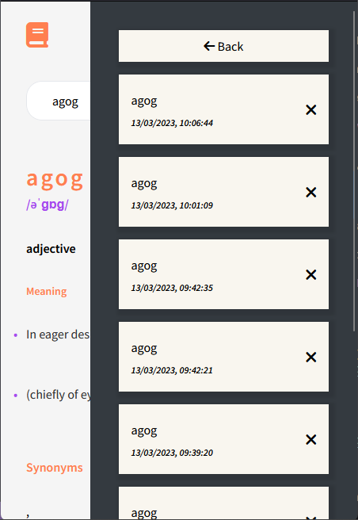
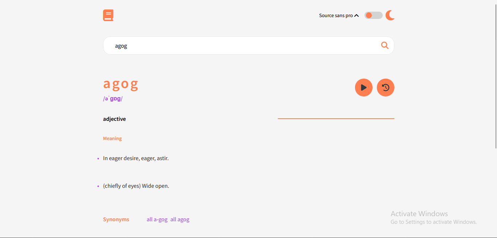
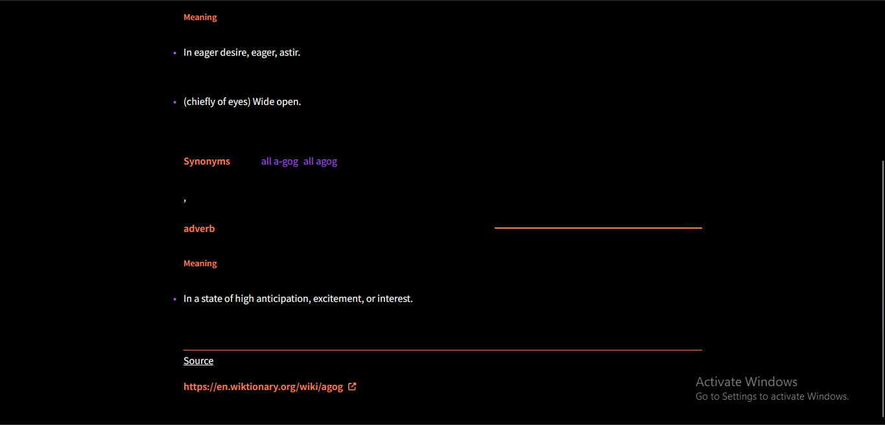

# Dictionary Web Application

## Challenge

I challenged myself to build this project, because it's one of the several project I've got in mind to add to my portfolio. This project posed several challenges and at the end I loved the final result which made the journey building this awesome!

While building this, I had setup some user stories while building this to help clients experiences using this application.
Here are some of the user stories I setup a user should be able to do using this platform.

## Dictionary user stories

- users must be able to search for a given word ✅
- throw error when word can't be found ✅
- users must be able to toggle between font-families ✅
- users must be able to view layouts for different screen sizes ✅
- users must have history of all their searched items ✅
- history must persist in localStorage ✅
- users must be able to toggle background colors ✅
- implementation of word of the day ✅

## Screenshots








## Tools used

- HTML5
- SCSS/SASS
- Vanilla JS
- [Tailwind](https://tailwindcss.com/docs/installation) - Tailwind CSS is a cascading style sheet framework
- [Parcel](https://parceljs.org/) - Parcel used to bundle and minify the modules used building this application

## Live URL:

[WordHive](https://wordhive.netlify.app/) - Wordhive can be viewed here

## One major key thing I learnt

while building this, I learnt a lot.
One of the major code I wrote that I really liked was the implementation of the word of the day algorithm.

```js
  #lastGeneratedTime = parseInt(localStorage.getItem('lastGeneratedTime')) || 0;
  #currentTime = new Date().getTime(); // results in milliseconds
  #timeSinceLastGenerated = this.#currentTime - this.#lastGeneratedTime;
  #twentyFourHours = 86400000;
  #timeLeft = this.#twentyFourHours - this.#timeSinceLastGenerated;
  #generatedWord = JSON.parse(localStorage.getItem('generatedWord')) || '';

    // if time since the last word generated is greater than or equal to 24hours
    if (this.#timeSinceLastGenerated >= this.#twentyFourHours) {
      this.#generatedWord = getRandomWord();
      localStorage.setItem('lastGeneratedTime', this.#currentTime.toString());
      localStorage.setItem('generatedWord', JSON.stringify(this.#generatedWord));
    } else {
      console.log(`Time until next random word generation: ${this.#timeLeft / 1000} seconds`);
    }

    this._generateRandomWords();
    localStorage.setItem('lastGeneratedTime', this.#currentTime.toString());

     _generateRandomWords() {
    if (!this.#generatedWord) {
      this.#generatedWord = getRandomWord();
    }
    this.input.value = this.#generatedWord;
    this._fetchWord(this.#generatedWord);
    localStorage.setItem('generatedWord', JSON.stringify(this.#generatedWord));
  }
```

## About

wordHive is a comprehensive online dictionary that provides definitions, synonyms, antonyms, and usage examples for a vast array of words and phrases. Our user-friendly interface allows you to easily search for the word you're looking for and quickly find its meaning. We're constantly updating our database with new words and phrases to ensure that our users have access to the most up-to-date information. Whether you're a student, a writer, or simply a lover of language, wordHive is the perfect tool for expanding your vocabulary and improving your communication skills.
